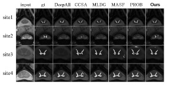

# Domain Generalization for Medical Imaging Classification with Linear Dependency Regularization
The code release of paper 'Domain Generalization for Medical Imaging Classification with Linear-Dependency Regularization' NeurIPS 2020.
The pre-print paper can be found in [Arxiv](https://arxiv.org/pdf/2009.12829.pdf).

## How to use
First, you need to install the package surface-distance https://github.com/deepmind/surface-distance and SimpleITK
```
pip install SimpleITK
```
Then run the following command to train and evaluate the performance of the model
```
python3 train_lddg.py -t i
```
where i means set_i is the target domain.

## Segmentation Reuslts


## Please cite our paper if you find it's useful.
- @article{li2020domain,
  title={Domain Generalization for Medical Imaging Classification with Linear-Dependency Regularization},
  author={Li, Haoliang and Wang, YuFei and Wan, Renjie and Wang, Shiqi and Li, Tie-Qiang and Kot, Alex C},
  journal={arXiv preprint arXiv:2009.12829},
  year={2020}
}


